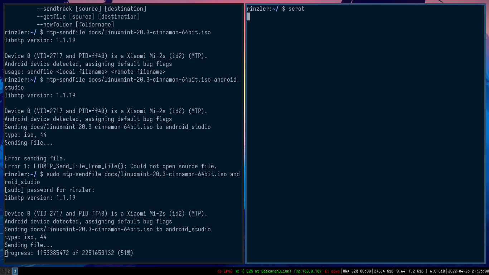

# My i3-gaps installation
This is the repo containing all the descriptional files, and dot-files from my i3-gaps install on arch-linux.

## Dot-files :
All the files inside the [Dot files](dot-files/) directory should be installed to your $HOME directory.. and all the paths from the dot-files directory are relative to the user's $HOME directory.

## Virtualisation :
This folder contains two files.
One [Description file](virtualisation/kvm-installation) and one [XML File](virtualisation/br10.xml) used to Define the Bridged Network Connection.

## Scripts:
This folder contains a few shell [scripts](scripts/dual.sh) I've written to facilitate and automate some of my processes \[Has only one as of now\].

#### Misc :

There are a few descriptional files in this repo.
These files might show the use of "pacman" (the awesome package manager arch linux ships with). But feel free to change the commands to suit your distro's package manager commands.

There are also a few screen-shot files in the repo, which are useful to visualize some of the commands. 
(For example, The Android File Transfer commands; as shown below:)

